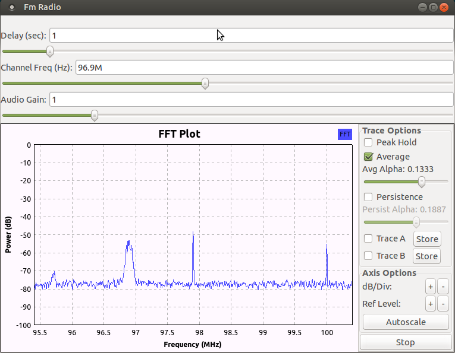
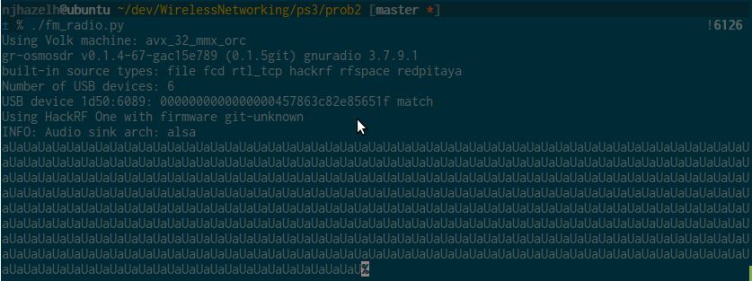

# Problem Set 3: HackRF One
**Nick Jones, Phaelyn Kotuby**

The purpose of this problem set was to work with the HackRF One to send
and receive wireless signals and interact with signal encoding.

## Problem 1: SDR Platform Setup
Problem 1 involved the setup process of the HackRF One and associated tools.
Overall, this part was not very complicated.  Other than some minor issues
resolving dependencies, the installation process was relatively
straight-forward.

To confirm that we had connected the HackRF One correctly, we ran
`hackrf_info` which responded with information about the attached HackRF such
as the serial number, ...

After this we checked that we could interact with the HackRF by running
osmocom_fft from the gr-osmosdr module.  We found a 2.4 GHz wifi channel
and saw activity.

## Problem 2: Building FM Radio Receiver
Part 2 involved creating a FM radio receiver and a tool to play recorded
audio at different speeds.

We encountered a few problems with this part.  Although we could see one or two
radio stations there weren't nearly as many as we were expecting.  There were
some very strong signals around 96.9 and 100.2, but other than this, we
couldn't see much else.  This may be due to our antenna being too short.  We
tried compensating by increasing the RX gain in the osmocom source, but it
didn't seem to have too much affect.

We also encountered issues with audio underrun.  Because we were running
the environment in a virtual machine, this resulted in issues with the
audio sink output.  Although we processed the FM signal correctly,
the audio was clipped and warped.  At first we thought that this was some
kind of processing issue, but after dumping the audio to a wav file and
playing it back, we realized that the signal was fine.  According to the
GNU radio-companion documentation, there is no simple solution to this
problem.  It recommended a quick hack of supplying information to the
audio sink at a slightly faster rate than it expects, but this did not
seem to work when we tried.

 
**Each aU is an audio underrun error**

To create the delay effect, we added a delay block and a WX Slider.  We fed the
output from the low pass filter into the delay block which we configured
with the sample rate times the value of the slider (seconds).  We then multiplied
the output of the delay block with the original signal.  This created resulted
in overlapping signals.  One consequence of this is that when the delay is still
filling its buffer, the output is zero, which overruns the original output.

To create the playback script, we stored the signal from the FM receiver to a
file.  We then read this file and throttled the data to the default rate.
We then took this data and interpolated it at a ratio defined using a WX slider.
This resulted in the signal playing faster or slower than normal.

## Problem 3: BPSK/QPSK Transmission Simulation
Problem 3 involved creating flowgraphs to represent BPSK and QPSK modulators
and demodulators. Additionally, we needed to write Python scripts to read
gnuradio file outputs and determine bit error ratios between two files.

BSPK was relatively straightforward to encode by following the instructions;
changing the flowgraph to accomodate QPSK required some better understanding
of gnuradio and how to use the constellation object. Ultimately, though, the
differences between the two flowgraphs were minor. In addition, the python
scripts to process them are essentially the same -- they just use different
file parameters and were split so that the two encodings could be analyzed
more quickly. Calculating the BER was as simple as reading in the files for
pre- and post-modulated bits, putting them into arrays of binary, and then
checking the number of differences between the two.

When measured against set signal-to-noise ratios, BPSK generally performed 
better than QPSK when the SNR was lower; however, the two eventually converged
and, given higher SNRs, we expect that QPSK would outperform BPSK. Because 
QPSK transmits 2 bits per symbol, it would have a higher throughput overall
when put against any amounts of noise. 

## Problem 4: Real Transmission using HackRF
Problem 4 involved creating a wireless transmitter and receiver and using
them to transfer a set of random data.

In this part, we had some minor issues getting two HackRFs to work at the same
time.  We expected that we would be able to specify the transmitter and
receiver by changing the serial number in the osmocom source and sink.  This
did not work as expected.  Regardless of the ordering, we couldn't get the
information to transmit.  The solution we came up with was to disconnect one of
the HackRFs and force the receiver to start on the connected one.  We then
attached the second one and started the transmitter using the serial number.

The output from the receiver was stored to prob4_rx_output.  After running it
for a little bit, this file contained 174592 bytes, which we counted using
`wc -c`.  Since we used the payload length of 0 (defaults to 512), this means
that 174592/512 = 341 packets were correctly received.  If we ran it for a
different length of time, this would obviously change.
